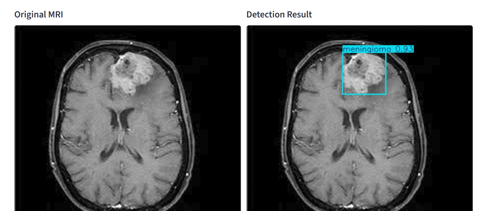
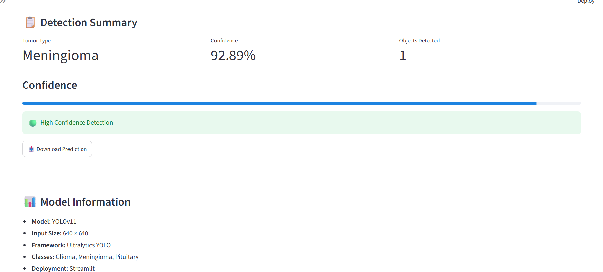

# 🧠 Brain Tumor Detection using YOLOv11

A deep learning-based web application that detects and localizes brain tumors from MRI scans using **YOLOv11**. The application predicts the tumor type, highlights the tumor location with a bounding box, and displays the confidence score through an interactive Streamlit interface.

---

## 🚀 Live Demo

🔗 https://your-streamlit-app-url.streamlit.app

---

## 📌 Features

- Detects brain tumors from MRI images
- Supports three tumor classes:
  - Glioma
  - Meningioma
  - Pituitary
- Displays bounding box around detected tumor
- Shows prediction confidence score
- Download annotated prediction image
- Interactive Streamlit web application

---

## 🧠 Model

- Model: YOLOv11
- Framework: Ultralytics YOLO
- Input Size: 640 × 640
- Deployment: Streamlit

---

## 📊 Model Performance

| Metric | Score |
|---------|-------|
| Precision | **90.4%** |
| Recall | **87.3%** |
| mAP@0.5 | **92.0%** |
| mAP@0.5:0.95 | **69.9%** |

---

## 📷 Application Preview

## Demo

### Original MRI vs Detection Result



### Detection Summary



---

---

## 🛠️ Tech Stack

- Python
- PyTorch
- Ultralytics YOLOv11
- OpenCV
- Streamlit
- NumPy
- Matplotlib

---

## 📂 Project Structure

```
Brain-Tumor-Detection-YOLOv11/
│
├── app.py
├── best.pt
├── requirements.txt
├── README.md
├── screenshot/
│   ├── img1.png
│   └── img2.png
└── notebook.ipynb
```

---

## ⚙️ Installation

Clone the repository

```bash
git clone https://github.com/Aishu-selvan/Brain-Tumor-Detection-YOLOv11.git
```

Go to the project folder

```bash
cd Brain-Tumor-Detection-YOLOv11
```

Create a virtual environment

**Windows**

```bash
python -m venv venv
venv\Scripts\activate
```

Install dependencies

```bash
pip install -r requirements.txt
```

Run the application

```bash
streamlit run app.py
```

---

## 📌 Note

This model is trained to detect only the following tumor types:

- Glioma
- Meningioma
- Pituitary

It is **not trained on normal MRI images (No Tumor)**. Therefore, predictions on normal MRI scans may not be reliable. This project is intended for educational and research purposes only and should not be used for medical diagnosis.

---

## 👩‍💻 Author

**Aiswarya T**
- LinkedIn: https://linkedin.com/in/aiswarya-tamilselvan-8a11b7361

---

⭐ If you found this project useful, consider giving it a star!
